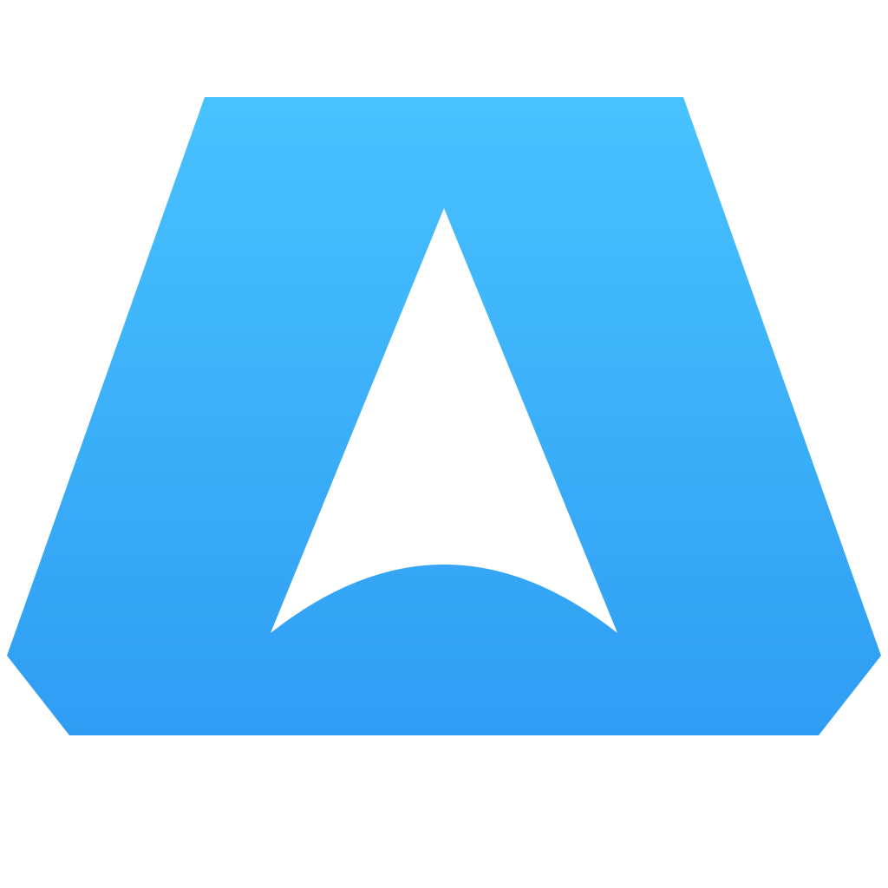
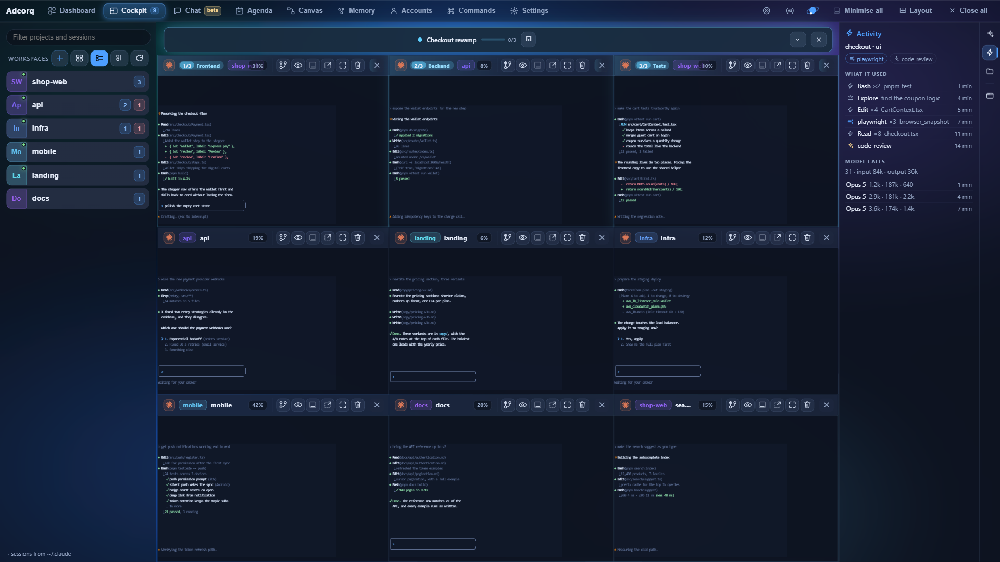
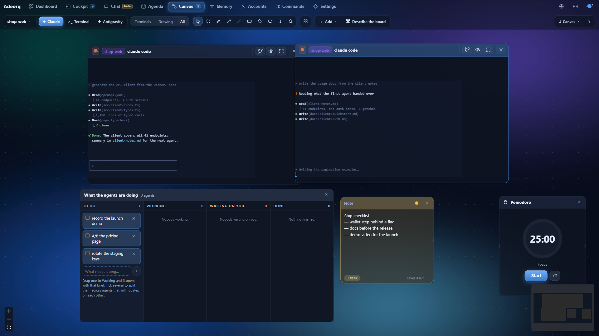
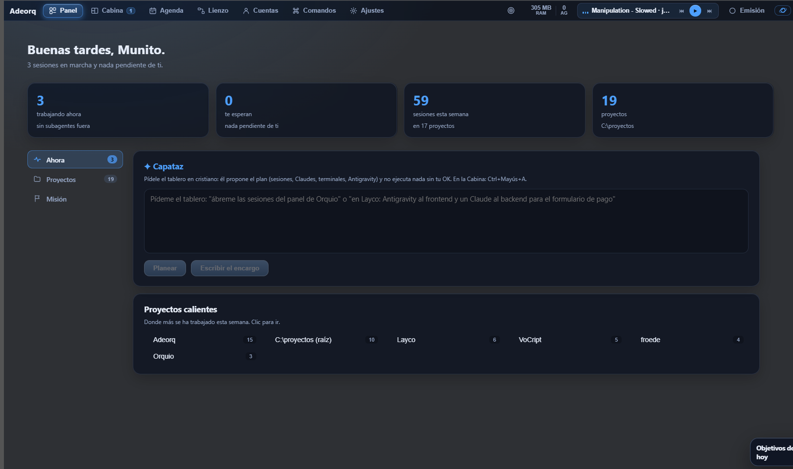

<div align="center">



# Adeorq

### Nine agents working. One screen.

A Windows desktop panel that opens your projects in **real terminals** — the same ConPTY the
system uses, not a chat box imitating one — shows your Claude Code sessions with their actual
state, and lets you run several agents at once without losing track of any of them.

<br>

<!-- The buttons are HTML `` with an explicit width (markdown image syntax
     mis-sized them). And a lesson written in blood: the Windows button was
     BROKEN on GitHub for nine days because of a double hyphen inside an XML
     comment of the SVG itself — an SVG served as image/svg+xml parses in
     strict mode and dies whole. `pnpm svg` now guards every SVG in the repo. -->
<a href="https://github.com/Mun1to/Adeorq-releases/releases/latest/download/Adeorq-setup.exe"></a>
<a href="https://github.com/Mun1to/Adeorq-releases/releases/latest/download/Adeorq-x86_64.AppImage"></a>

**Free · no account · no API keys · updates itself**

[](https://github.com/Mun1to/Adeorq-releases/releases/latest)
&nbsp;
[All releases](https://github.com/Mun1to/Adeorq-releases/releases) ·
[Website](https://adeorq.com) ·
[Guide](https://adeorq.com/guia) ·
[Español](README.es.md)

<br>



</div>

---

## It runs on YOUR account

Adeorq neither sells nor bundles access to any model. It **uses the subscriptions you already
pay for** and the CLIs you already have installed: Claude Code, Codex, Gemini CLI,
Antigravity, Copilot, Qwen, Crush, opencode, Amp, Cursor, pi and Kiro. If you have more than
one account, each terminal can be born on a different one.

That is the whole reason it exists: **new model features land on the command line before they
land in desktop apps**. Adeorq builds the experience on top of those programs instead of
replacing them, so the day something new ships, you have it.

## What is inside

| | |
|---|---|
| **The Cockpit** | A grid of real terminals. Split them, move them, set them aside without closing them, and find them where you left them next time. |
| **Your sessions** | Reads `~/.claude` with no API at all: title, real state (asking you / finished / halfway), how long ago, and which ones are still alive. One click resumes any of them inside the panel. |
| **The Foreman** | Tell it what you want out loud and it proposes a board. Nothing runs without your OK, and the plan goes through a deterministic gate before you even see it. |
| **The Canvas** | An infinite board with the terminals living inside it, plus notes, images, a kanban, and arrows that hand one agent's output to the next. |
| **The web pane** | Your localhost right beside the agent building it: a small browser with tabs, back and forward, and one click to swap in YOUR real browser, extensions and all. |
| **Activity** | What is going on behind the focused terminal: which skills and MCP servers it is using, every tool call, and each request to the model with its tokens. |
| **Shadow Mode** | Each agent in its own git worktree. You read the diff and decide whether it lands or gets thrown away. |
| **The Agenda** | What is coming at you, your goals for the day, and the ideas your agents leave behind along the way. |
| **Memory** | Your Obsidian vault inside the panel, searchable by what the notes say, with a map of what links to what. |

<div align="center">


</div>

## Windows will warn you when you install it

**That is expected.** The installer is not code-signed — an Authenticode certificate costs
several hundred euros a year — so SmartScreen shows *"Windows protected your PC"* the first
time.

To carry on: **More info → Run anyway**.

Always download it from
[this repository's releases page](https://github.com/Mun1to/Adeorq-releases/releases/latest)
and nowhere else. And once installed, **updates are signed**: Adeorq verifies each one's
cryptographic signature before applying it, so that warning only ever appears once.

## On Linux

Download
**[Adeorq-x86_64.AppImage](https://github.com/Mun1to/Adeorq-releases/releases/latest/download/Adeorq-x86_64.AppImage)**,
make it executable and run it. There is nothing to install:

```bash
chmod +x Adeorq-x86_64.AppImage
./Adeorq-x86_64.AppImage
```

The [releases page](https://github.com/Mun1to/Adeorq-releases/releases/latest) also carries a
`.deb` for Debian and Ubuntu (`sudo apt install ./Adeorq_*.deb`).

**Three things work differently**, and it is better to know them upfront:

- **Secrets.** On Windows they go to the Credential Manager, which encrypts them with your
  login. Linux has no such vault, so they go to a `600` file under
  `~/.local/share/adeorq/secretos`: that protects them from other users of the machine, not
  from another program of yours.
- **The music controls** (what is playing, next, volume) are Windows-only: the system itself
  publishes that, and the Linux equivalent is MPRIS, which is not in yet.
- **The window is translucent**, so it needs a compositing desktop. Any modern GNOME or KDE
  has one; without a compositor the glass will look opaque.

It is built on **Ubuntu 22.04**, so it needs glibc 2.35 or newer (Ubuntu 22.04+, Debian 12+,
Fedora 36+, Arch).

## Building it yourself

```bash
pnpm install
pnpm tauri dev      # development window
pnpm tauri build    # installer
```

You need [Rust](https://rustup.rs). On Windows, also the Visual Studio build tools; on Linux,
Tauri 2's own:

```bash
sudo apt install build-essential pkg-config libssl-dev \
  libgtk-3-dev libwebkit2gtk-4.1-dev libayatana-appindicator3-dev librsvg2-dev patchelf
```

## Don't trust it, check it

Open source only helps if somebody actually reads the code, and almost nobody does. So
instead of asking you to trust this project, here is the prompt to check it: point your own
AI agent at this repository and get a security report, in your language, in a few minutes,
even if you do not know how to program.

**[Open AI-AUDIT.md](AI-AUDIT.md)** and paste it into Claude Code, Codex, Cursor, Copilot or
whatever you use. It is the same prompt in every public repository here, so you can compare.

> **ES:** No hace falta que te fíes. Abre [AI-AUDIT.md](AI-AUDIT.md), pega ese texto en tu IA
> y te dirá en tu idioma qué hace este programa de verdad: qué envía por internet, qué toca
> en tu ordenador y qué ejecuta al instalarse.

## Licence

**[PolyForm Shield License 1.0.0](LICENSE)** — an off-the-shelf licence written by
lawyers, not a bespoke EULA.

You may do **anything** with Adeorq, including using it for your work and your
company's: read the source, study it, audit it, modify it, compile it, fork it and
distribute it. The one thing you may not do is use it to provide a product that
**competes** with Adeorq. The licence spells out that competing includes giving it
away free, and that marketing something as a practical substitute for Adeorq
"definitely competes".

Put the way people actually ask it: **you cannot sell Adeorq**, nor a modified
version of it, nor charge others for access to it. Selling the work YOU do with
Adeorq is your business.

Trademark and AI-provider notices are in [`NOTICE.md`](NOTICE.md). Third-party
components keep their own licences, with every copyright notice collected in
[`THIRD-PARTY-NOTICES.md`](THIRD-PARTY-NOTICES.md).


## Built on

Adeorq would not exist without these. All permissively licensed, all credited one by one with
their copyright in [`THIRD-PARTY-NOTICES.md`](THIRD-PARTY-NOTICES.md).

| | |
|---|---|
| [**Tauri**](https://tauri.app) | The window and the bridge to Rust. A 5 MB binary instead of 150. |
| [**xterm.js**](https://xtermjs.org) | The terminal emulator, with its WebGL renderer. |
| [**portable-pty**](https://github.com/wezterm/wezterm/tree/main/pty) (WezTerm) | Real ConPTY, from Rust. |
| [**React**](https://react.dev) + [**Vite**](https://vite.dev) | The interface. |
| [**React Flow**](https://reactflow.dev) | The infinite canvas. |
| [**Ollama**](https://ollama.com) · [**whisper.cpp**](https://github.com/ggml-org/whisper.cpp) | What runs on your own machine: summaries and dictation, without leaving the house. |

## Notices

Not affiliated with Anthropic, OpenAI, Google or Microsoft. Their names and logos are
trademarks of their respective owners and appear here only to identify which tool you are
working with.

Something wrong? [Open an issue](https://github.com/Mun1to/Adeorq-releases/issues).
