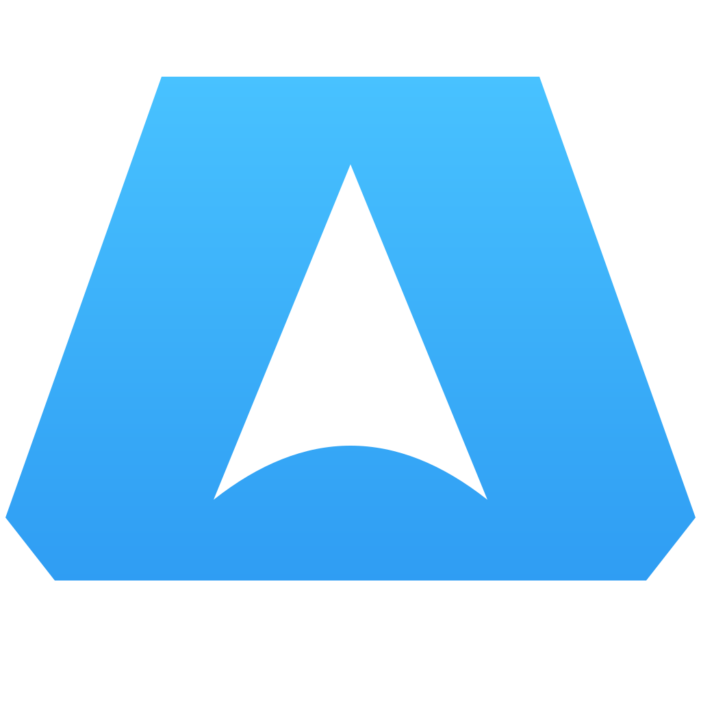
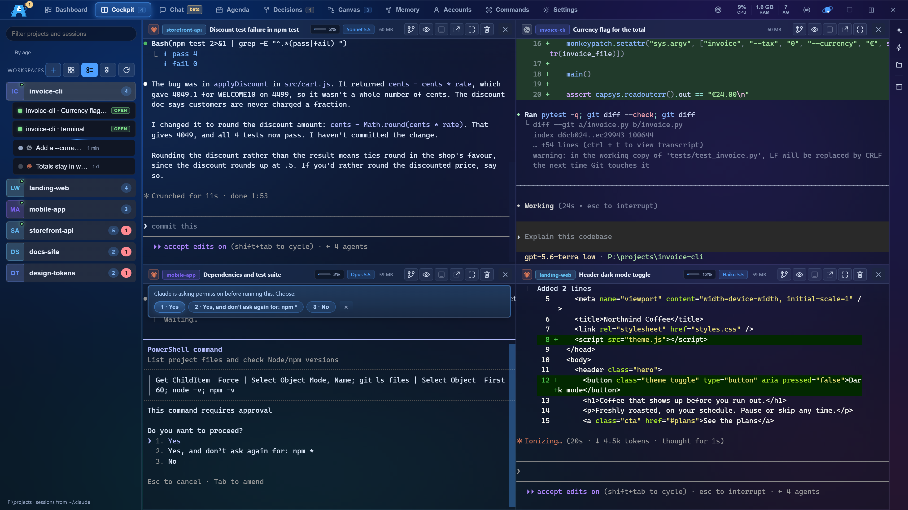
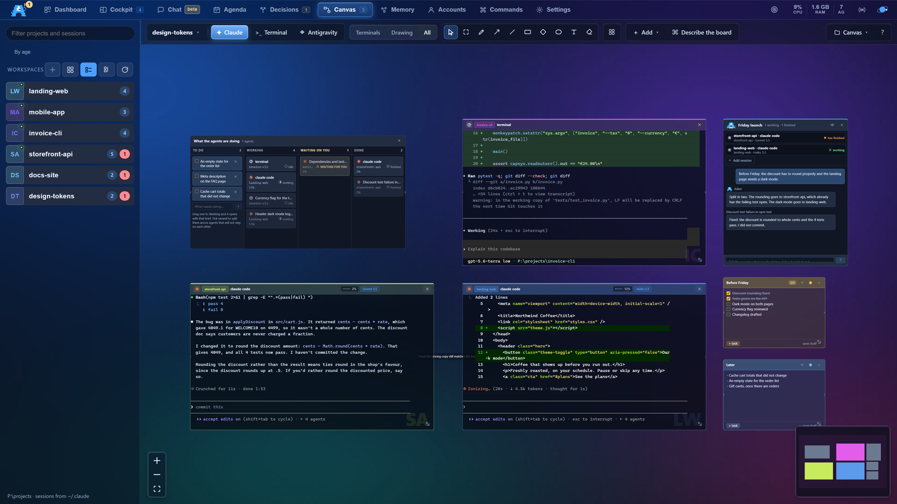
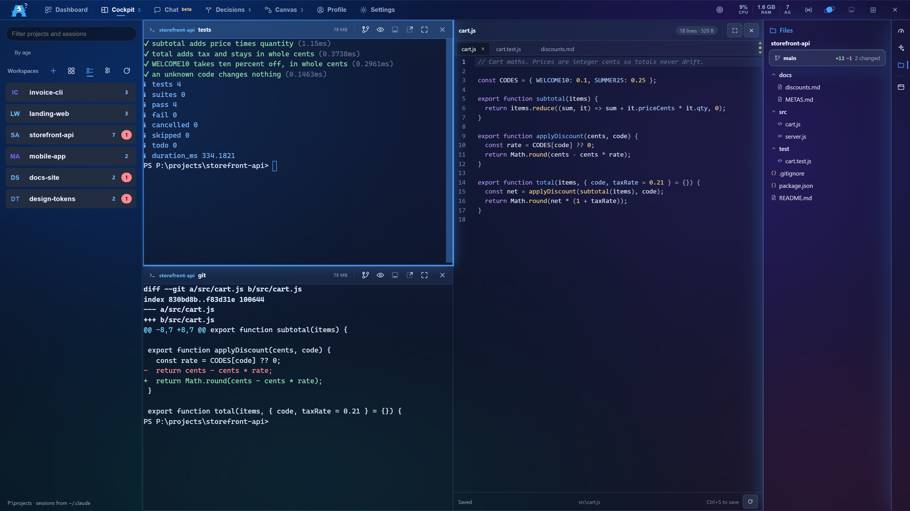
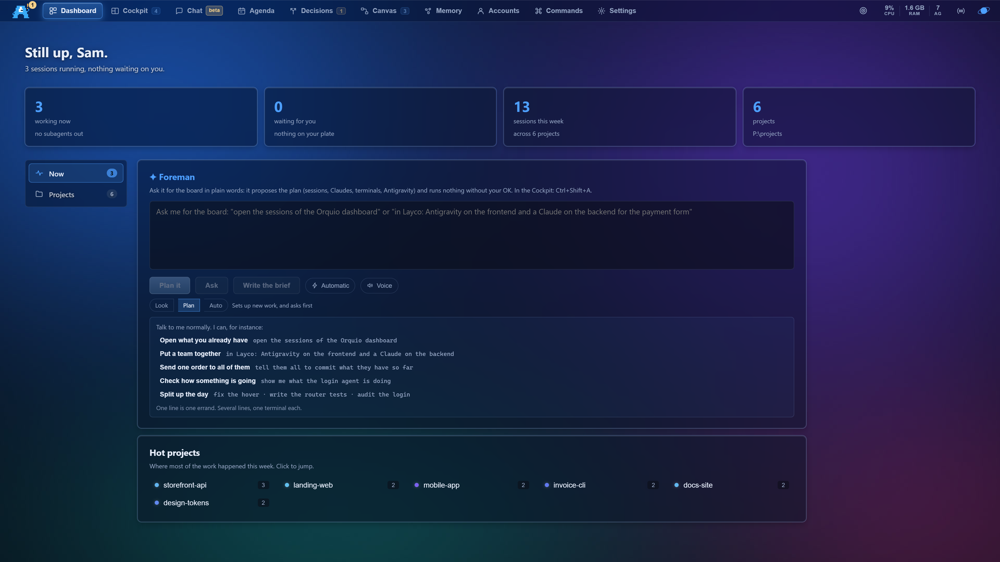
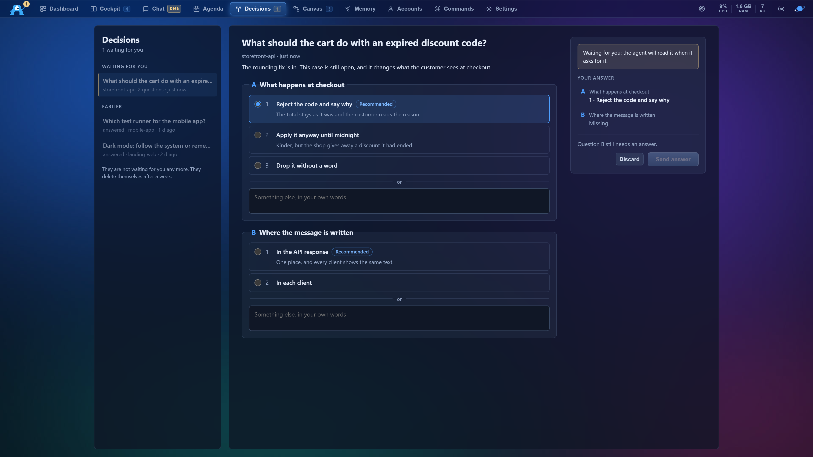
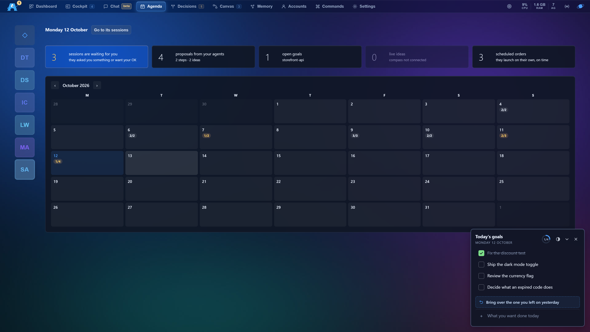
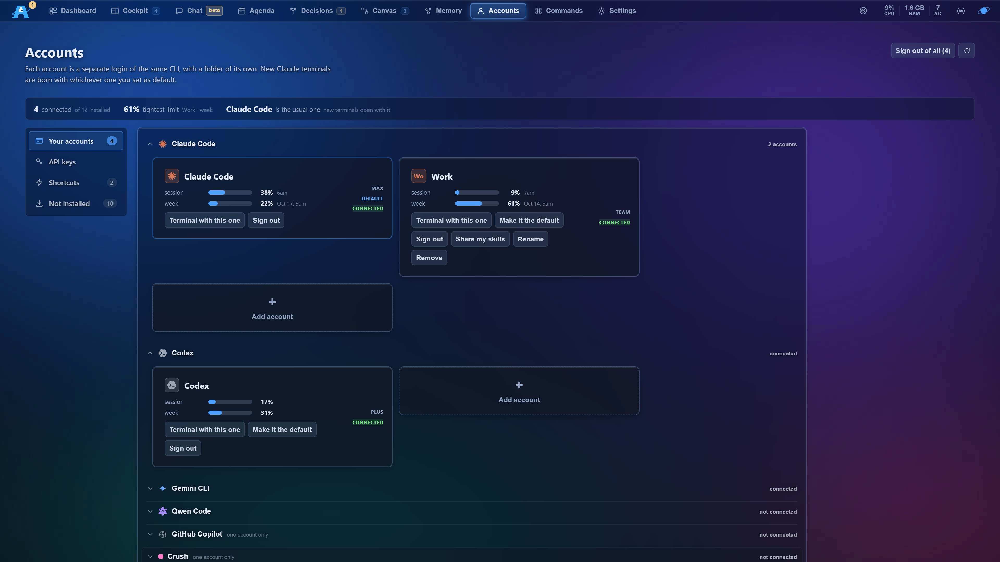

<div align="center">



# Adeorq

### Nine agents working. One screen.

A desktop panel for Windows and Linux that opens your projects in **real terminals** — the
same ConPTY the system uses, not a chat box imitating one — shows your Claude Code sessions
with their actual state, and lets you run several agents at once without losing track of any
of them. And it comes with you: **from your phone or any browser**, wherever you are.

<br>

<!-- The buttons are HTML `` with an explicit width (markdown image syntax
     mis-sized them). And a lesson written in blood: the Windows button was
     BROKEN on GitHub for nine days because of a double hyphen inside an XML
     comment of the SVG itself — an SVG served as image/svg+xml parses in
     strict mode and dies whole. `pnpm svg` now guards every SVG in the repo. -->
<a href="https://github.com/Mun1to/Adeorq-releases/releases/latest/download/Adeorq-setup.exe"></a>
<a href="https://github.com/Mun1to/Adeorq-releases/releases/latest/download/Adeorq-x86_64.AppImage"></a>

**Free · no account · no API keys · updates itself**

[](https://github.com/Mun1to/Adeorq-releases/releases/latest)
&nbsp;
[All releases](https://github.com/Mun1to/Adeorq-releases/releases) ·
[Website](https://adeorq.com) ·
[Guide](https://adeorq.com/guia) ·
[Español](README.es.md)

<br>



<sub>Four agents, four projects. One has finished, two are working, and one is asking permission, with the answer one click away.</sub>

</div>

---

## Up and running in a minute

1. **Download it and open it.** There is no account to create and no key to paste.
2. **Tell it where your projects live.** Every folder in there becomes a project in the sidebar,
   with the sessions you already had in each one.
3. **Click a project.** A session of your usual CLI opens in a real terminal, in that folder
   (Claude Code, out of the box). Click another project and you have two.

## It runs on YOUR account

Adeorq neither sells nor bundles access to any model. It **uses the subscriptions you already
pay for** and the CLIs you already have installed, twenty-two of them today: Claude Code,
Codex, Gemini CLI, Antigravity, Copilot, Cursor, Qwen, Grok, Kimi Code, Kiro, pi, opencode,
Crush, Amp, Aider, Goose, Droid, Jules, Auggie, Codebuff, Cody and CodeWhale. If you have more
than one account, each terminal can be born on a different one.

That is the whole reason it exists: **new model features land on the command line before they
land in desktop apps**. Adeorq builds the experience on top of those programs instead of
replacing them, so the day something new ships, you have it.

## What is inside

| | |
|---|---|
| **The Cockpit** | A grid of real terminals. Split them, move them, set them aside without closing them, and find them where you left them next time. And if you want, they survive Adeorq itself: with **Settings → Terminals → Keep the terminals alive if Adeorq crashes** (experimental), your agents keep working through a crash and reattach when you open it again. |
| **Your sessions** | Reads `~/.claude`, and Codex's `~/.codex`, with no API at all: title, real state (asking you / finished / halfway), how long ago, and which ones are still alive. One click resumes any of them inside the panel. |
| **The Foreman** | Tell it what you want out loud and it proposes a board. Nothing runs without your OK, and the plan goes through a deterministic gate before you even see it. |
| **The Canvas** | An infinite board with the terminals living inside it, plus notes, images, a kanban, and arrows that hand one agent's output to the next. A note with a title and steps can be **saved as a runbook** in the project's `docs/fichas`, ready to repeat. |
| **Swarms** | Join sessions that are already open on the canvas into one group chat: drop a terminal on another, or **Add › Swarm**. What you type goes to Adeo, who picks the session it belongs to, rewrites the task and sends it; what each session answers comes back to the chat under its name. |
| **The web pane** | Your localhost right beside the agent building it: a small browser with tabs, back and forward, and one click to swap in YOUR real browser, extensions and all. |
| **Files** | The project's tree beside the terminals. Create files and folders, rename them or move them to the recycle bin from the right-click menu; open one in the editor, where images and PDFs show as themselves. And **Ctrl+K → Search in the files** finds text inside the project and opens the hit at its line. It also shows **what your agent touches**: the latest thing that terminal's session did, and the files it read, edited or committed. |
| **Activity** | What is going on behind the focused terminal: which skills and MCP servers it is using, every tool call, and each request to the model with its tokens. |
| **Shadow Mode** | Each agent in its own git worktree. You read the diff and decide whether it lands or gets thrown away. |
| **Decisions** | When an agent needs you to choose, it asks with numbered options and says which one it would pick. You answer in its own tab, or from your phone, and the answer goes straight back to the terminal that asked. |
| **The Agenda** | What is coming at you, your goals for the day, and the ideas your agents leave behind along the way. Plus orders that run on their own, on the days and at the hour you set, with a breaker that stops one after three failures in a row. |
| **Accounts** | Several logins of the same CLI side by side, each with its plan and how much of its limit is left. You choose which one new terminals are born with, or open a terminal on a specific one. |
| **Commands** | Everything you can type inside each agent, searchable by what you want to do rather than by its name, and sent to the terminal with one click. |
| **Memory** | Your Obsidian vault inside the panel, searchable by what the notes say, with a map of what links to what. |
| **The Concierge** | One chat that opens sessions for you as tabs, with a router that picks which model or client takes each job. |
| **On your phone** | The Concierge, your sessions and every terminal, from any browser and wherever you are. Attach photos, get a notification when an agent asks you something. |
| **Adeo** | The little pixel A in the top bar is the bell. He types when your agents are working, waves when one is waiting for you, jumps when one finishes and sleeps when there are none, and follows your mouse with his eye. |

<div align="center">






</div>

<sub>Every screenshot is the real app, opened on a demo workshop instead of anybody's projects. The agents in the
terminals are real sessions, recorded in those demo projects and played back; the accounts and their limits are
sample data.</sub>

## From your phone, or any browser

Adeorq can travel with you: from your phone, a tablet or another computer you talk to the
Concierge, read your sessions, type into any terminal and get a notification when an agent
finishes or asks you something. What you see is **your PC**, not a copy in the cloud, so it
has to be on with Adeorq open. Set it up once:

1. Install [Tailscale](https://tailscale.com/download) on the PC and on your phone, and sign
   in with the same account on both. It is a private network between your devices, free for
   personal use.
2. In Adeorq, open **Settings → Mobile** and turn on **Concierge on my phone**.
3. Press **Bring the concierge to Tailscale**. The first time, Tailscale may ask you to enable
   HTTPS on your account: if a link appears, open it, enable it and press again.
4. Press **Pair a phone**. You get a QR code with your address
   (`https://your-pc.your-net.ts.net:8443`) and a six-digit code that lasts ten minutes.
5. On your phone, with Tailscale on, scan the QR code, type the code and press **Emparejar**
   (Pair). Each browser pairs once.

When an agent needs you to choose something, it asks you with its numbered options and the
question reaches your phone, under **Decisions**; your answer goes straight back to the terminal
that asked. And a **mode button** does what Shift+Tab does on the PC in Claude Code.

On Android the page installs as an app with its own icon; on iPhone, Safari → Share → Add to
Home Screen. **Why it is safe to leave on:** Adeorq only listens inside your PC and Tailscale
carries it to your devices through an encrypted tunnel, so it cannot be seen from the
internet; every request still needs the key of a paired device, and only a fingerprint of
each key is kept on disk. Full steps in [the guide](https://adeorq.com/guia#movil).

## Windows will warn you when you install it

**That is expected.** The installer is not code-signed — an Authenticode certificate costs
several hundred euros a year — so SmartScreen shows *"Windows protected your PC"* the first
time.

To carry on: **More info → Run anyway**.

Always download it from
[this repository's releases page](https://github.com/Mun1to/Adeorq-releases/releases/latest)
and nowhere else. And once installed, **updates are signed**: Adeorq verifies each one's
cryptographic signature before applying it, so that warning only ever appears once.

## On Linux

Download
**[Adeorq-x86_64.AppImage](https://github.com/Mun1to/Adeorq-releases/releases/latest/download/Adeorq-x86_64.AppImage)**,
make it executable and run it. There is nothing to install:

```bash
chmod +x Adeorq-x86_64.AppImage
./Adeorq-x86_64.AppImage
```

The [releases page](https://github.com/Mun1to/Adeorq-releases/releases/latest) also carries a
`.deb` for Debian and Ubuntu (`sudo apt install ./Adeorq_*.deb`) and an `.rpm` for Fedora
(`sudo dnf install ./Adeorq-*.rpm`).

**Four things work differently**, and it is better to know them upfront:

- **Secrets.** On Windows they go to the Credential Manager, which encrypts them with your
  login. Linux has no such vault, so they go to a `600` file under
  `~/.local/share/adeorq/secretos`: that protects them from other users of the machine, not
  from another program of yours.
- **The music controls** (what is playing, next, volume) are Windows-only: the system itself
  publishes that, and the Linux equivalent is MPRIS, which is not in yet.
- **The window is translucent**, so it needs a compositing desktop. Any modern GNOME or KDE
  has one; without a compositor the glass will look opaque.
- **Closing the window quits Adeorq**, because there is no tray icon to keep it alive. So the
  Agenda's scheduled orders only run while Adeorq is open.

It is built on **Ubuntu 22.04**, so it needs glibc 2.35 or newer (Ubuntu 22.04+, Debian 12+,
Fedora 36+, Arch).

## Building it yourself

```bash
pnpm install
pnpm tauri dev      # development window
pnpm tauri build    # installer
```

You need [Rust](https://rustup.rs). On Windows, also the Visual Studio build tools; on Linux,
Tauri 2's own:

```bash
sudo apt install build-essential pkg-config libssl-dev \
  libgtk-3-dev libwebkit2gtk-4.1-dev libayatana-appindicator3-dev librsvg2-dev patchelf
```

## Don't trust it, check it

Open source only helps if somebody actually reads the code, and almost nobody does. So
instead of asking you to trust this project, here is the prompt to check it: point your own
AI agent at this repository and get a security report, in your language, in a few minutes,
even if you do not know how to program.

**[Open AI-AUDIT.md](AI-AUDIT.md)** and paste it into Claude Code, Codex, Cursor, Copilot or
whatever you use. It is the same prompt in every public repository here, so you can compare.

> **ES:** No hace falta que te fíes. Abre [AI-AUDIT.md](AI-AUDIT.md), pega ese texto en tu IA
> y te dirá en tu idioma qué hace este programa de verdad: qué envía por internet, qué toca
> en tu ordenador y qué ejecuta al instalarse.

## Licence

**[PolyForm Shield License 1.0.0](LICENSE)** — an off-the-shelf licence written by
lawyers, not a bespoke EULA.

You may do **anything** with Adeorq, including using it for your work and your
company's: read the source, study it, audit it, modify it, compile it, fork it and
distribute it. The one thing you may not do is use it to provide a product that
**competes** with Adeorq. The licence spells out that competing includes giving it
away free, and that marketing something as a practical substitute for Adeorq
"definitely competes".

Put the way people actually ask it: **you cannot sell Adeorq**, nor a modified
version of it, nor charge others for access to it. Selling the work YOU do with
Adeorq is your business.

Trademark and AI-provider notices are in [`NOTICE.md`](NOTICE.md). Third-party
components keep their own licences, with every copyright notice collected in
[`THIRD-PARTY-NOTICES.md`](THIRD-PARTY-NOTICES.md).


## Built on

Adeorq would not exist without these. All permissively licensed, all credited one by one with
their copyright in [`THIRD-PARTY-NOTICES.md`](THIRD-PARTY-NOTICES.md).

| | |
|---|---|
| [**Tauri**](https://tauri.app) | The window and the bridge to Rust. A 5 MB binary instead of 150. |
| [**xterm.js**](https://xtermjs.org) | The terminal emulator, with its WebGL renderer. |
| [**portable-pty**](https://github.com/wezterm/wezterm/tree/main/pty) (WezTerm) | Real ConPTY, from Rust. |
| [**React**](https://react.dev) + [**Vite**](https://vite.dev) | The interface. |
| [**React Flow**](https://reactflow.dev) | The infinite canvas. |
| [**Ollama**](https://ollama.com) · [**whisper.cpp**](https://github.com/ggml-org/whisper.cpp) | What runs on your own machine: summaries and dictation, without leaving the house. |

## Notices

Not affiliated with Anthropic, OpenAI, Google or Microsoft. Their names and logos are
trademarks of their respective owners and appear here only to identify which tool you are
working with.

Something wrong? [Open an issue](https://github.com/Mun1to/Adeorq-releases/issues).
